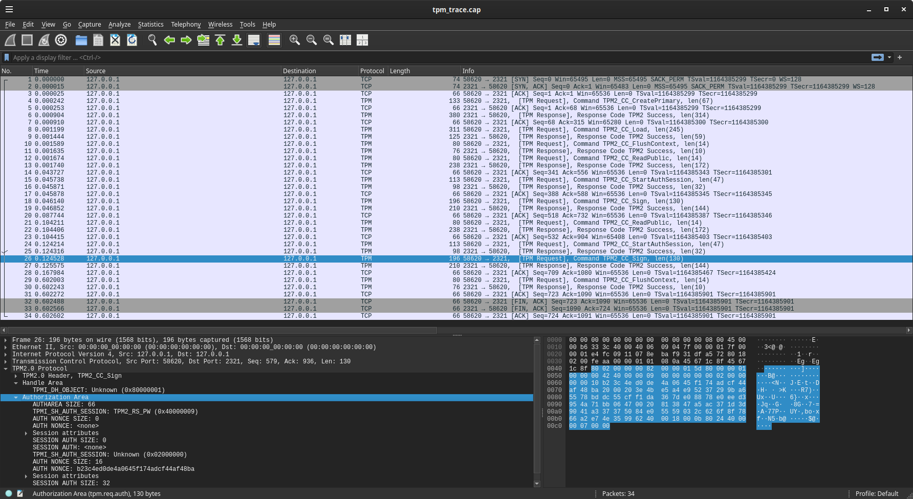
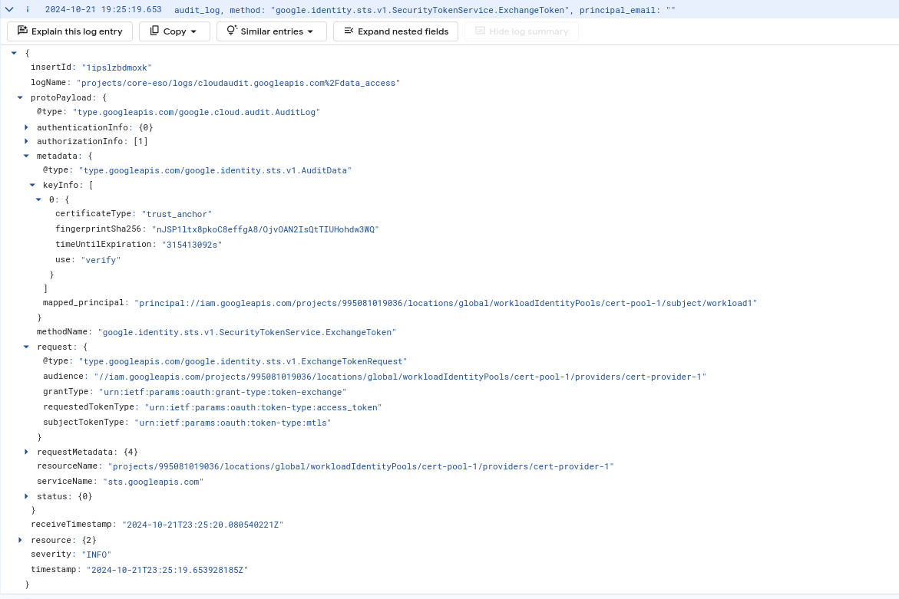
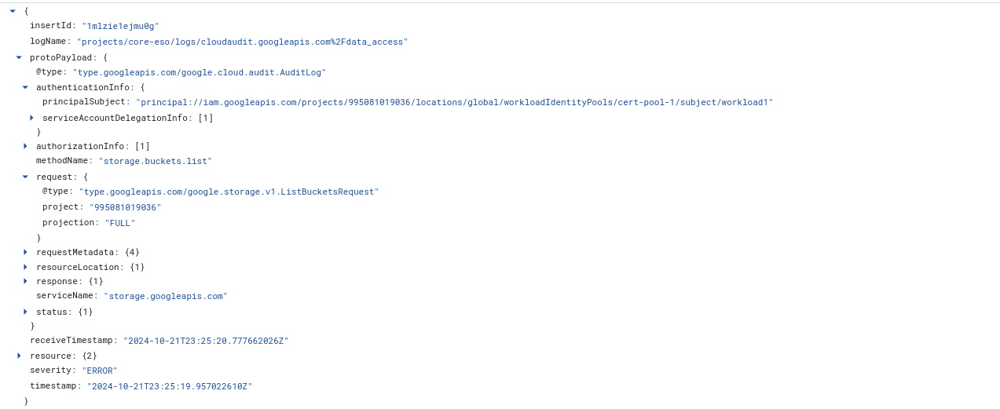
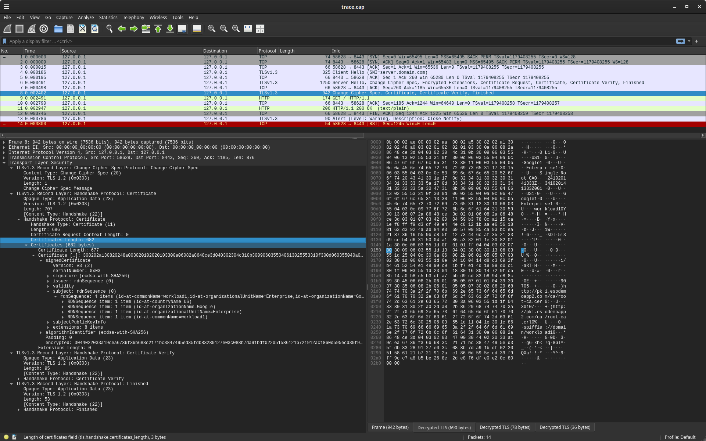
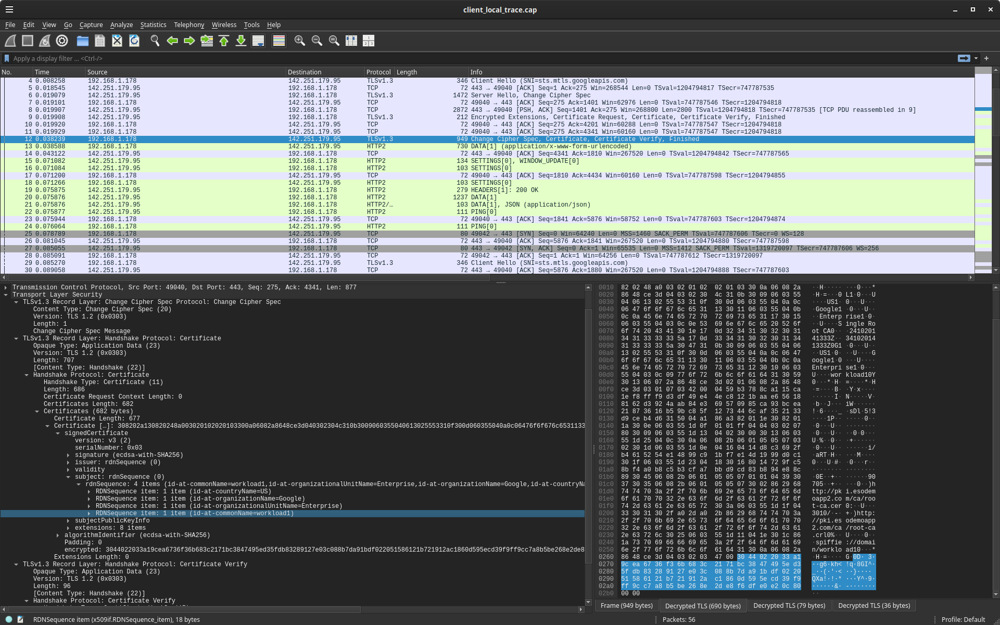

### GCP Workload Identity Federation using x509 certificates

[GCP Workload Federation with x509 certificates](https://cloud.google.com/iam/docs/workload-identity-federation-with-x509-certificates) where the private key is either

1) embedded in a `Trusted Platform Module (TPM)`
2) provided by an anything that implements a golang [crypto.Signer](https://pkg.go.dev/crypto#Signer) (eg, HSM, TPM, PKCS11, Yubikey, ordinary PEM private keys)

Currently, GCP Workload Federation requires the client key to be accessible [directly as a file](https://github.com/googleapis/google-cloud-go/blob/main/auth/internal/transport/cert/workload_cert.go#L73). 

The samples in this repo demonstrates how to bootstrap credentials where the mTLS private key is embedded inside a device.

>> WARNING: this repo is not supported by Google

Also see:

* `Federation`

  - [GCP Workload Identity Federation using OIDC Credentials](https://github.com/salrashid123/gcpcompat-oidc)
  - [GCP Workload Identity Federation using SAML Credentials](https://github.com/salrashid123/gcpcompat-saml)
  - [GCP Workload Identity Federation using AWS Credentials](https://github.com/salrashid123/gcpcompat-aws)

* `mtls`

  - [mTLS with TPM bound private key](https://github.com/salrashid123/go_tpm_https_embed)
  - [mTLS with PKCS11](https://github.com/salrashid123/mtls_pkcs11)
  - [nginx with TPM based SSL](https://blog.salrashid.dev/articles/2021/nginx_with_tpm_ssl/)
  - [TPM based TLS using Attested Keys](https://github.com/salrashid123/tls_ak)
  - [go mTLS with multiple certificate issuers and OCSP verification](https://github.com/salrashid123/go_mtls_scratchpad)

* `crypto.Signer`

  - [crypto.Signer, implementations for Google Cloud KMS and Trusted Platform Modules](https://github.com/salrashid123/signer)
  - [go-tpm-tools.client.Signer](https://pkg.go.dev/github.com/google/go-tpm-tools/client#Key.GetSigner)
  - [ThalesIgnite.crypto11.Signer](https://pkg.go.dev/github.com/ThalesIgnite/crypto11#Signer)
  - [pion/dtls/issues/524](https://github.com/pion/dtls/issues/524#issuecomment-2144017793)
  - [PKCS 11 Samples in Go using SoftHSM](https://github.com/salrashid123/go_pkcs11)

* `JWT Signers`

  - [golang-jwt for Trusted Platform Module (TPM)](https://github.com/salrashid123/golang-jwt-tpm)
  - [golang-jwt for crypto.Signer](https://github.com/salrashid123/golang-jwt-signer)
  - [golang-jwt for PKCS11](https://github.com/salrashid123/golang-jwt-pkcs11)

* `TPM`

  - [Trusted Platform Module (TPM) recipes with tpm2_tools and go-tpm](https://github.com/salrashid123/tpm2)

---

### Setup

The following end-to-end demo uses a software tpm (`swtpm`) for simplicity.

The rough steps are:

1. create a local CA
2. create a server certificate for testing
3. start a software TPM locally
4. generate an private key on the TPM
5. use openssl to issue a CSR
6. generate a client certificate
7. test client and server certificate locally
8. configure workload federation using local ca
9. add IAM binding for federated identity
10. access gcp resource after getting token using client certificate

To use this sample end-to-end, you'll need

- `openssl3`
- [tpm2-openssl](https://github.com/tpm2-software/tpm2-openssl/tree/master)
- [tpm2-tools](https://github.com/tpm2-software/tpm2-tools)
- `go`
- [tpm2tss-genkey](https://github.com/tpm2-software/tpm2-tss-engine/blob/master/man/tpm2tss-genkey.1.md) or [tpm2genkey](https://github.com/salrashid123/tpm2genkey)
- [Software TPM](https://github.com/stefanberger/swtpm) (optional) 

##### Create CA

```bash
### Create CA

cd example/

git clone https://github.com/salrashid123/ca_scratchpad.git
cd ca_scratchpad/

mkdir -p ca/root-ca/private ca/root-ca/db crl certs
chmod 700 ca/root-ca/private
cp /dev/null ca/root-ca/db/root-ca.db
cp /dev/null ca/root-ca/db/root-ca.db.attr

echo 01 > ca/root-ca/db/root-ca.crt.srl
echo 01 > ca/root-ca/db/root-ca.crl.srl

openssl genpkey -algorithm ec -pkeyopt  ec_paramgen_curve:P-256 \
      -pkeyopt ec_param_enc:named_curve \
      -out ca/root-ca/private/root-ca.key

export SAN=single-root-ca

openssl req -new  -config single-root-ca.conf  -key ca/root-ca/private/root-ca.key \
   -out ca/root-ca.csr  

openssl ca -selfsign     -config single-root-ca.conf  \
   -in ca/root-ca.csr     -out ca/root-ca.crt  \
   -extensions root_ca_ext
```

##### Configure Workload Federation

```bash
export PROJECT_ID=`gcloud config get-value core/project`
export PROJECT_NUMBER=`gcloud projects describe $PROJECT_ID --format='value(projectNumber)'`
export POOL_ID="cert-pool-1"
export PROVIDER_ID="cert-provider-1"

### >>> NOTE: ca/root-ca.crt must be just the PEM file, no headers
# openssl x509 -in ca/root-ca.crt -text \
#   -certopt no_header,no_pubkey,no_subject,no_issuer,no_signame,no_version,no_serial,no_validity,no_extensions,no_sigdump,no_aux,no_extensions

export ROOT_CERT=$(cat ca/root-ca.crt | sed 's/^[ ]*//g' | sed -z '$ s/\n$//' | tr '\n' $ | sed 's/\$/\\n/g')

cat << EOF > trust_store.yaml
trustStore:
  trustAnchors:
  - pemCertificate: "${ROOT_CERT}"
EOF

gcloud iam workload-identity-pools create $POOL_ID \
    --location="global" \
    --description="Certificate Pool" \
    --display-name="Certificate Pool 1"

## note, if you have the org policy constraints/iam.workloadIdentityPoolProviders set, you will need to allow "MTLS"
gcloud iam workload-identity-pools providers create-x509 $PROVIDER_ID \
    --location=global \
    --workload-identity-pool=$POOL_ID \
    --trust-store-config-path="trust_store.yaml" \
    --attribute-mapping="google.subject=assertion.subject.dn.cn" \
    --billing-project="$PROJECT_ID"

## add an iam policy binding.  
# Since w'ere using the default attribute mapping, the  CN= value in the cert is the subject.  
# In our case, its going to be "workload1" in a later step
gcloud projects add-iam-policy-binding $PROJECT_ID  \
 --member "principal://iam.googleapis.com/projects/$PROJECT_NUMBER/locations/global/workloadIdentityPools/$POOL_ID/subject/workload1" \
   --role --role=roles/storage.admin
```

##### Configure Certificates

Create a test server certificate.  This cert is used later on to test locally before invoking workload federation:

```bash
### create server certificate
export NAME=server
export SAN="DNS:server.domain.com"

openssl genpkey -algorithm ec -pkeyopt  ec_paramgen_curve:P-256 \
      -pkeyopt ec_param_enc:named_curve \
      -out certs/$NAME.key

openssl req -new     -config server.conf \
  -out certs/$NAME.csr   \
  -key certs/$NAME.key \
  -subj "/C=US/O=Google/OU=Enterprise/CN=server.domain.com"

openssl ca \
    -config single-root-ca.conf \
    -in certs/$NAME.csr \
    -out certs/$NAME.crt \
    -extensions server_ext
```

##### Client

Start software TPM

```bash
rm -rf /tmp/myvtpm && mkdir /tmp/myvtpm  && \
   sudo swtpm_setup --tpmstate /tmp/myvtpm --tpm2 --create-ek-cert && \
    sudo swtpm socket --tpmstate dir=/tmp/myvtpm --tpm2 --server type=tcp,port=2321 --ctrl type=tcp,port=2322 --flags not-need-init,startup-clear --log level=2

## in a new window
export TPM2TOOLS_TCTI="swtpm:port=2321"
export TPM2OPENSSL_TCTI="swtpm:port=2321"
export TPM2TSSENGINE_TCTI="swtpm:port=2321"
export OPENSSL_MODULES=/usr/lib/x86_64-linux-gnu/ossl-modules/  
 # or wherever tpm2.so sits, eg /usr/lib/x86_64-linux-gnu/ossl-modules/tpm2.so
# export TSS2_LOG=esys+debug

$ openssl list --providers -provider tpm2
Providers:
  tpm2
    name: TPM 2.0 Provider
    version: 1.2.0-25-g87082a3
    status: active
```

create client key and certificate

```bash
## create h2 primary
printf '\x00\x00' > certs/unique.dat
tpm2_createprimary -C o -G ecc -g sha256 \
  -c certs/rprimary.ctx \
  -a "fixedtpm|fixedparent|sensitivedataorigin|userwithauth|noda|restricted|decrypt" -u certs/unique.dat

### create key
export NAME=workload1
export SAN="URI:spiffie://domain/workload1"

tpm2_create -G ecc:ecdsa -g sha256 -u certs/rkey.pub -r certs/rkey.priv -C certs/rprimary.ctx
tpm2_flushcontext -t
tpm2_load -C certs/rprimary.ctx -u certs/rkey.pub -r certs/rkey.priv -c certs/rkey.ctx
tpm2_print -t TPM2B_PUBLIC certs/rkey.pub

### make it persistent
tpm2_evictcontrol -C o -c certs/rkey.ctx 0x81008001
tpm2_flushcontext -t

## convert the key public/private --> PEM
#### use either official
###### https://github.com/tpm2-software/tpm2-tss-engine/blob/master/man/tpm2tss-genkey.1.md
# tpm2tss-genkey -u certs/rkey.pub -r certs/rkey.priv certs/$NAME.pem 
#### or in go, download as release binary which doesn't require older tpm2-tss-engine
######  https://github.com/salrashid123/tpm2genkey/releases
/tmp/tpm2genkey --mode=tpm2pem --public=certs/rkey.pub --private=certs/rkey.priv  --out=certs/$NAME.pem 

openssl ec -provider tpm2  -provider default -in certs/$NAME.pem  --text

# todo, use openssl to gen the key, unfortunately, this key doesn't encode all the scheme values 
## openssl genpkey -provider tpm2 -provider default -algorithm ec -pkeyopt  ec_paramgen_curve:P-256  -out certs/rkey2.pem
## /usr/bin/tpm2tss-genkey --public=certs/rkey.pub --private=certs/rkey.priv  --out=certs/rkey_test.pem
## tpm2_print -t TPM2B_PUBLIC certs/rkey2.pub

openssl req -provider tpm2 -provider default -new \
    -config client.conf \
    -out certs/$NAME.csr \
    -key certs/$NAME.pem \
    -subj "/C=US/O=Google/OU=Enterprise/CN=workload1"

openssl ca \
    -config single-root-ca.conf \
    -in certs/$NAME.csr \
    -out certs/$NAME.crt \
    -extensions client_ext
```

Note, `certs/$NAME.pem` is the [PEM formatted TPM file](https://www.hansenpartnership.com/draft-bottomley-tpm2-keys.html) (its still encrypted by the TPM):

eg

```bash
$ cat certs/$NAME.pem
-----BEGIN TSS2 PRIVATE KEY-----
MIHyBgZngQUKAQOgAwEB/wIEQAAAAQRaAFgAIwALAAQAcgAAABAAGAALAAMAEAAg
WbN4jKEVyh74//nT30nkTsgSG6rmVhiBYtOSSquE42kAIFcJhcqTvOohhzYWtZvI
XxJzRGyvNSEz2c601jFQBKGGBIGAAH4AIJQuNactvVACOQb6aUM1f82z1nvI77bJ
zcy06z7FOhZlABBgyf5keg6kbMYVmoWL5Jz844e8RJYmj0Kuv2trWbmueKbX0khO
itmepjBiswClYzq3cZKZTTpEeHAlmK7TK7BCrK5oaXP34VjBzJ4RIysrQUBWARR3
hBqKKb0=
-----END TSS2 PRIVATE KEY-----
```

#### Test local server

To test the TPM locally, run a simple local webserver server

```bash
## as openssl
openssl s_server -cert certs/server.crt   -key certs/server.key \
      -accept 8443 -CAfile ca/root-ca.crt  -Verify 5  -tls1_3 -WWW -tlsextdebug

## or as golang
go run server/main.go
```

To test the client key on the TPM

```bash
openssl s_client -provider tpm2 -provider default  \
       -connect localhost:8443 \
       -servername server.domain.com \
       -CAfile ca/root-ca.crt \
       -cert certs/$NAME.crt \
       -key handle:81008001 \
       -tls1_3 -state \
       -tlsextdebug \
       --verify 5  -showcerts
#### enter GET / HTTP/1.1<enter><enter>

## or as go with TPM
go run client_tpm/client.go

### as go with a crypto.Signer
go run client_singer/client.go
```

Both should return a simple "ok" back from the the servers

### Test Workload federation

Now we're ready to use the TPM based keys against a GCP resource, 

The following will initialize the TPM key, use it for mtls with sts server, get an `access_token`, then access gcs

```bash
## Using TPM 
go run gcp_tpm/client.go \
   --projectId=$PROJECT_ID --projectNumber=$PROJECT_NUMBER \
    --poolid="$POOL_ID" --providerid="$PROVIDER_ID" \
     -pubCert=ca_scratchpad/certs/workload1.crt \
     --keyfile=ca_scratchpad/certs/workload1.pem

## Using Signer
go run gcp_signer/client.go \
   --projectId=$PROJECT_ID --projectNumber=$PROJECT_NUMBER \
    --poolid="$POOL_ID" --providerid="$PROVIDER_ID" \
     -pubCert=ca_scratchpad/certs/workload1.crt \
     --keyfile=ca_scratchpad/certs/workload1.pem

```

The TPM is actually invoked to sign (`TPM2_CC_SIGN`):



If you had audit logging enabled, you'd see the sts exchange




as a full log, it would be 

```json
{
  "protoPayload": {
    "@type": "type.googleapis.com/google.cloud.audit.AuditLog",
    "status": {},
    "authenticationInfo": {},
    "requestMetadata": {
      "callerIp": "22.127.34.114",
      "callerSuppliedUserAgent": "Go-http-client/2.0",
      "requestAttributes": {
        "time": "2024-10-21T23:25:19.662597395Z",
        "auth": {}
      },
      "destinationAttributes": {}
    },
    "serviceName": "sts.googleapis.com",
    "methodName": "google.identity.sts.v1.SecurityTokenService.ExchangeToken",
    "authorizationInfo": [
      {
        "permission": "sts.identityProviders.checkLogging",
        "permissionType": "ADMIN_READ"
      }
    ],
    "resourceName": "projects/995081011211/locations/global/workloadIdentityPools/cert-pool-1/providers/cert-provider-1",
    "request": {
      "@type": "type.googleapis.com/google.identity.sts.v1.ExchangeTokenRequest",
      "audience": "//iam.googleapis.com/projects/995081011211/locations/global/workloadIdentityPools/cert-pool-1/providers/cert-provider-1",
      "grantType": "urn:ietf:params:oauth:grant-type:token-exchange",
      "requestedTokenType": "urn:ietf:params:oauth:token-type:access_token",
      "subjectTokenType": "urn:ietf:params:oauth:token-type:mtls"
    },
    "metadata": {
      "mapped_principal": "principal://iam.googleapis.com/projects/995081011211/locations/global/workloadIdentityPools/cert-pool-1/subject/workload1",
      "keyInfo": [
        {
          "certificateType": "trust_anchor",
          "fingerprintSha256": "nJSP1ltx8pkoC8effgA8/OjvOAN2IsQtTIUHohdw3WQ",
          "timeUntilExpiration": "315413092s",
          "use": "verify"
        }
      ],
      "@type": "type.googleapis.com/google.identity.sts.v1.AuditData"
    }
  },
  "insertId": "1ipslzbdmoxk",
  "resource": {
    "type": "audited_resource",
    "labels": {
      "service": "sts.googleapis.com",
      "project_id": "core-eso",
      "method": "google.identity.sts.v1.SecurityTokenService.ExchangeToken"
    }
  },
  "timestamp": "2024-10-21T23:25:19.653928185Z",
  "severity": "INFO",
  "logName": "projects/core-eso/logs/cloudaudit.googleapis.com%2Fdata_access",
  "receiveTimestamp": "2024-10-21T23:25:20.080540221Z"
}
```

Note, the `fingerprintSha256` is for the trust_anchor; not the client certificate

```bash
$ openssl x509  -in ../ca/root-ca.crt -outform DER | openssl sha256
    SHA2-256(stdin)= 9c948fd65b71f299280bc79f7e003cfce8ef38037622c42d4c8507a21770dd64

hex->base64("9c948fd65b71f299280bc79f7e003cfce8ef38037622c42d4c8507a21770dd64") =>
     "nJSP1ltx8pkoC8effgA8/OjvOAN2IsQtTIUHohdw3WQ"
```

If you had storage auditlogs enabled, you'd see:



---

#### TLS Trace

Since this is a demo, we'll also show the transport trace logs

- for local:

```bash
sudo tcpdump -s0 -ilo -w client_local_trace port 8443
export SSLKEYLOGFILE=client_local_keylog.log

go run client_tpm/client.go

# then
wireshark client_local_trace.cap -otls.keylog_file:client_local_keylog.log
```



- for GCP

```bash
sudo tcpdump -s0 -iany -w client_gcp_trace.cap host sts.mtls.googleapis.com
export SSLKEYLOGFILE=client_gcp_keylog.log

go run gcp_tpm/client.go

# then 
wireshark client_gcp_trace.cap -otls.keylog_file:client_gcp_keylog.log
```



* [OpenSSL 3.0.0 docker with TLS trace enabled (enable-ssl-trace) and FIPS (enable-fips)](https://github.com/salrashid123/openssl_trace)
* [Using Wireshark to decrypt TLS gRPC Client-Server protobuf messages](https://github.com/salrashid123/grpc_sslkeylog)